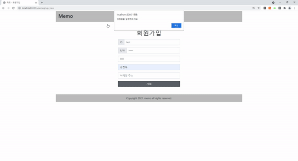
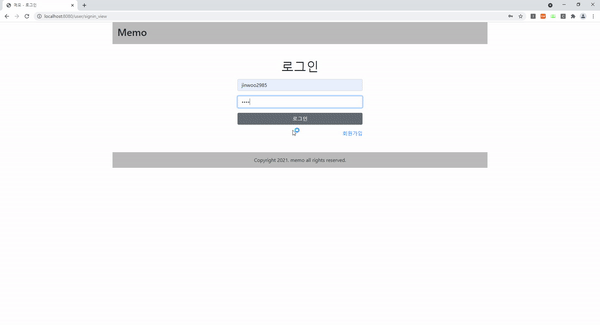
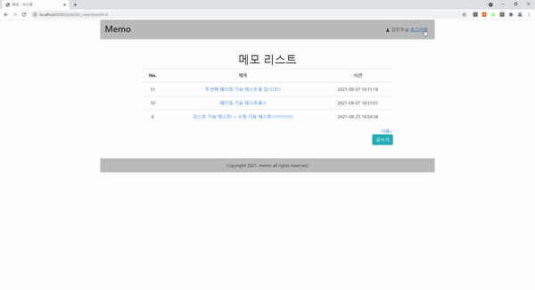
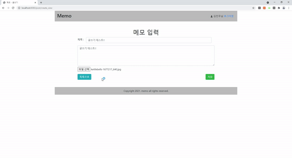
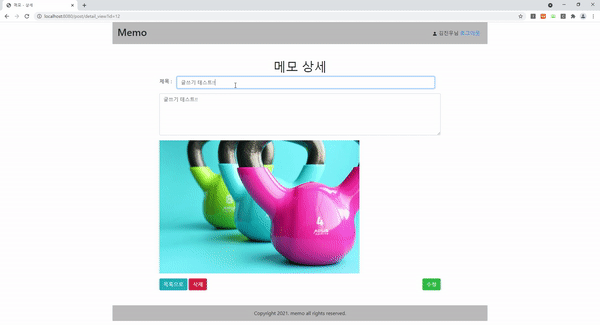

 </a>

<h1 align="center">Memo</h1>

### 🛠 &nbsp;Technical Skills
&nbsp;
&nbsp;
&nbsp;
&nbsp;
&nbsp;
&nbsp;\
 
&nbsp;
&nbsp;
&nbsp;\
&nbsp;
&nbsp;
&nbsp;

---

💡 메모한 내용을 저장하고 수정 / 삭제 할 수 있는 기본 프로젝트

## :book: 프로젝트 설명

* Spring framework를 이용해 진행한 첫번째 프로젝트 간단한 메모 기능 구현
* 로그인 기반의 프로젝트
* 메모 작성 / 수정 / 삭제 기능을 포함한 프로젝트

## :page_facing_up: 포트폴리오

### 링크를 클릭해주세요!! [포트폴리오](portfolio.pdf) 

## :paperclip: 구현한 핵심 기능 및 설명

* 회원가입
 #### * package : [com.kimjinwoo.memo.user.*](https://github.com/kjw7580/spring_memo_0816/tree/develop/src/main/java/com/kimjinwoo/memo/user)
 #### * view : [/webapp/WEB-INF/jsp/user/*](https://github.com/kjw7580/spring_memo_0816/tree/develop/src/main/webapp/WEB-INF/jsp/user)
* 로그인 및 로그아웃
 #### * package : [com.kimjinwoo.memo.user.*](https://github.com/kjw7580/spring_memo_0816/tree/develop/src/main/java/com/kimjinwoo/memo/user)
 #### * view : [/webapp/WEB-INF/jsp/user/*](https://github.com/kjw7580/spring_memo_0816/tree/develop/src/main/webapp/WEB-INF/jsp/user)
* 이미지 첨부 글쓰기
 #### * package : [com.kimjinwoo.memo.post.*](https://github.com/kjw7580/spring_memo_0816/tree/develop/src/main/java/com/kimjinwoo/memo/post)
 #### * view : [/webapp/WEB-INF/jsp/post/*](https://github.com/kjw7580/spring_memo_0816/tree/develop/src/main/webapp/WEB-INF/jsp/post)
* 글 수정 및 삭제
 #### * package : [com.kimjinwoo.memo.post.*](https://github.com/kjw7580/spring_memo_0816/tree/develop/src/main/java/com/kimjinwoo/memo/post)
 #### * view : [/webapp/WEB-INF/jsp/post/*](https://github.com/kjw7580/spring_memo_0816/tree/develop/src/main/webapp/WEB-INF/jsp/post)
* 리스트 페이징
 #### * package : [com.kimjinwoo.memo.post.*](https://github.com/kjw7580/spring_memo_0816/tree/develop/src/main/java/com/kimjinwoo/memo/post)
 #### * view : [/webapp/WEB-INF/jsp/post/*](https://github.com/kjw7580/spring_memo_0816/tree/develop/src/main/webapp/WEB-INF/jsp/post)
 
## :computer: 데모

### :bell: 회원가입

### :bell: 로그인

### :bell: 로그아웃

### :bell: 이미지 첨부 글쓰기

### :bell: 글 수정

### :bell: 글 삭제

### :bell: 리스트 페이징

## :scroll: License

&nbsp;
&nbsp;
  
&nbsp;
&nbsp;
&nbsp;
  
&nbsp;
&nbsp;

## :watch: Deploy History

### 2021-08-16 ~ 2021-08-21

- 프로젝트 기획
- DB 설계 / URL 설계 / 일정 설계
- 프로젝트 설정 / 세팅

### 2021-08-21 ~ 2021-08-24

- 모든 페이지 레이아웃 디자인 및 수정

### 2021-08-24 ~ 2021-08-30

- version-1 모든 기능 구현 및 테스트
- 구현한 기능 : 로그인 및 회원가입 / 이미지 첨부 글쓰기 / 글 수정 및 삭제 / 리스트 페이징

## :clock12: 향후 계획

 * 리스트에서 다음 / 이전 클릭시 페이징 -> 숫자 페이징으로 변경
 * 검색기능 추가
 * key별 ex)제목 / 내용 / 시간 등등 검색조회 기능 추가
